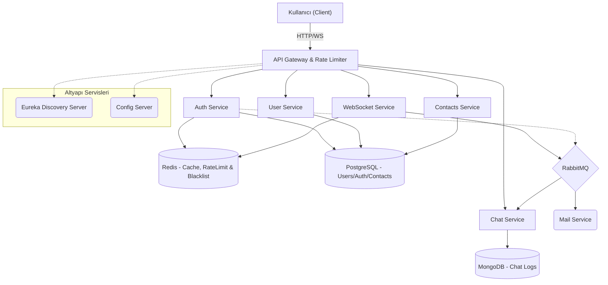
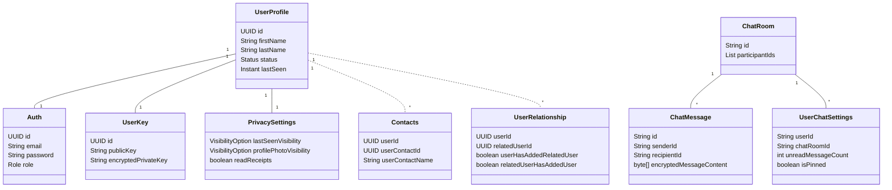
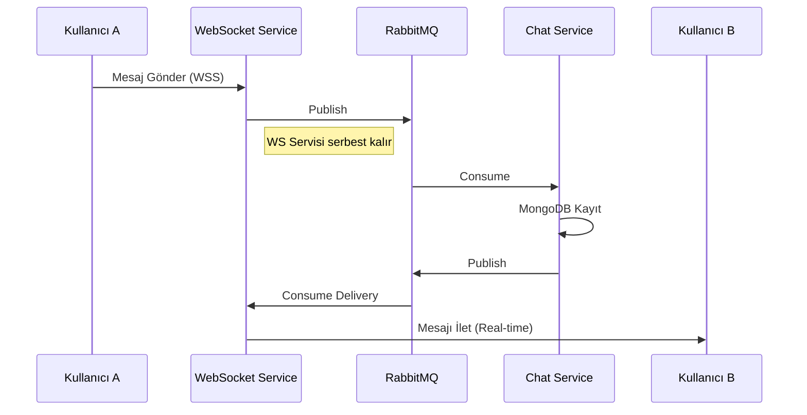
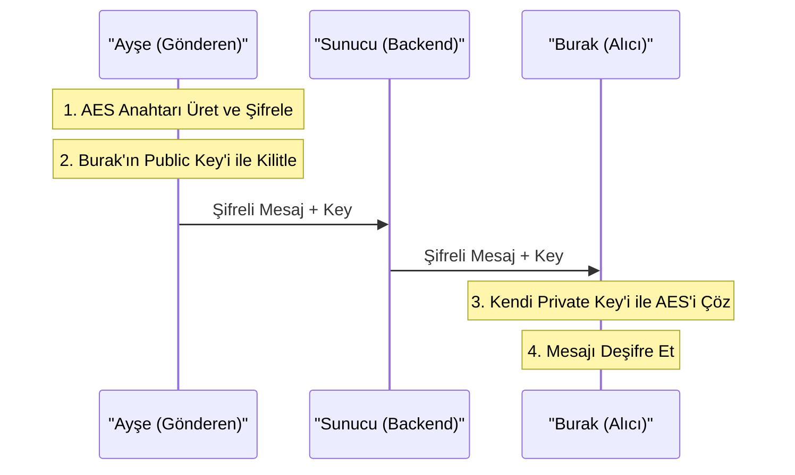
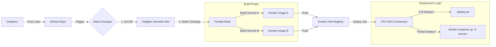

# Güvenli Chat Uygulaması: Backend Mimari ve Detayları

Bu dokümanda, yüksek performanslı ve tam güvenli (Uçtan Uca Şifreli - E2EE) bir gerçek zamanlı mesajlaşma (Chat) uygulamasının backend tarafında kullanılan mikroservis mimarisi, güvenlik önlemleri, veritabanı yapısı ve DevOps süreçleri detaylandırılmıştır.

**Proje Hakkında:** Bu uygulama basit bir mesajlaşma arayüzünün ötesine geçerek; RabbitMQ ve WebSockets aracılığıyla anlık ve kesintisiz iletişim altyapısı kuran, Spring Cloud (Eureka & API Gateway) desteğiyle mikroservis mimarisini yansıtan, MongoDB ile PostgreSQL'in hibrit (Polyglot Persistence) olarak kullanıldığı ve Zero-Knowledge (Sıfır Bilgi) prensibiyle sunucunun bile mesajları okuyamayacağı bir kriptografik düzene sahip gelişmiş bir sohbet sistemidir. Amacı, ölçeklenebilir ve tam anlamıyla "özel" bir iletişim kanalı inşa etmektir.

---

## 1. Genel Sistem Mimarisi ve Akış

Proje, karmaşıklığı yönetmek ve ölçeklenebilirliği artırmak amacıyla **Mikroservis Mimarisi** ile tasarlanmıştır.

### 1.1 Mimari Bileşenler

- **API Gateway (Spring Cloud Gateway)**: Sistemin dışa açılan kapısıdır. **Redis + Lua Script** tabanlı "Token Bucket" algoritması ile Rate Limiting (Hız Sınırlama) uygular. Ayrıca JWT doğrulama ve yük dengeleme (Load Balancing) işlemlerini üstlenir.
- **Service Discovery (Eureka)**: Mikroservislerin dinamik adres defteridir. Servislerin birbirini IP/Port bilmeden bulmasını sağlar (Client-Side Discovery).
- **Config Server**: Tüm mikroservislerin konfigürasyonlarını (Veritabanı, Port, Secret Key vb.) merkezi bir noktadan yönetir ve çalışma zamanında güncellemeyi sağlar.
- **Authentication Service**: Kimlik yönetim merkezidir. **Google reCAPTCHA v3** ile bot koruması sağlar ve çıkış yapan kullanıcıların tokenlarını **Redis Blacklist** üzerinde SHA-256 hash'leri ile bloklar.
- **WebSocket Service**: Gerçek zamanlı iletişimin merkezidir. **Redis Streams** kullanarak mesaj kaybını önler. Ayrıca kullanıcıların "Çevrimiçi/Çevrimdışı" durumlarını **Redis Key Expiration** eventlerini dinleyerek yönetir ve gizlilik kurallarına göre anlık broadcast eder.
- **Chat Service**: Mesajlaşma işlemlerini yönetir. Mesajları yüksek performans için **MongoDB** üzerinde saklar ve uçtan uca şifreli (E2EE) veri bütünlüğünü korur.
- **User Service**: Profil ve gizlilik ayarlarını yönetir. "Last Seen" gibi verileri, kullanıcının gizlilik ayarlarına göre (Örn: Sadece Arkadaşlar) filtreleyerek sunar.
- **Contacts Service**: Kişi listesi ve engelleme (Block) işlemlerini yönetir. İlişkisel veri tabanı (PostgreSQL) üzerinde kullanıcılar arası bağları tutar.
- **Notification/Mail Service**: Asenkron bildirim servisidir. **RabbitMQ** üzerinden gelen olayları (Event) dinler ve sistemi bloklamadan e-posta gönderir.

### 1.2 Sistem Akış Diyagramı



---

## 2. Veritabanı Mimarisi ve Kod Yapısı

Veri tutarlılığı ve performans için İlişkisel (PostgreSQL) ve Doküman tabanlı (MongoDB) veritabanları birlikte kullanılmıştır (Polyglot Persistence).

### 2.1 Varlık Diyagramı (ER Diagram)



---

## 3. İletişim Protokolleri: WebSocket ve REST Birlikte Kullanıldı?

Modern uygulamalarda "Her şey WebSocket olsun" veya "Her şey REST olsun" yaklaşımı yerine **Hibrit İletişim** modeli benimsenmiştir.

### 3.1 RESTful API (HTTP)

- **Kullanım Alanı**: Kullanıcı kaydı, girişi yapma, profil güncelleme, geçmiş mesajları listeleme.
- **Neden?**: Stateless (durumsuz) yapısı sayesinde sunucu kaynaklarını tüketmez. Cache mekanizmaları (CDN, Browser Cache) ile uyum halindedir. İste ve Cevap Al (Request-Response) mantığına uygun işlemler için idealdir.
- **Swagger/OpenAPI**: Tüm REST endpointleri Swagger ile dokümante edilmiştir.

### 3.2 WebSocket (STOMP)

- **Kullanım Alanı**: Anlık mesajlaşma, "Yazıyor..." bilgisi, Çevrimiçi/Çevrimdışı durum güncellemeleri.
- **Neden?**: REST her yeni veri için yeni bir HTTP bağlantısı açar (Header overhead). WebSocket ise tek bir TCP bağlantısı üzerinde sürekli açık bir kanal sağlar (Full-Duplex). Bu sayede milisaniyeler mertebesinde gerçek zamanlı iletişim kurulur.

```javascript
// Frontend: Robust WebSocket Manager (websocket.js)
export default class WebSocketManager {
  constructor(url) {
    this.client = new Client({
      brokerURL: this.url,
      reconnectDelay: 3000, // Auto-reconnect every 3s
      
      beforeConnect: () => {
        // Inject secure JWT token
        this.client.connectHeaders = {
            Authorization: `Bearer ${sessionStorage.getItem("access_token")}`,
        };
      },

      onWebSocketClose: async (evt) => {
        // Handle unexpected closures with backoff logic
        console.warn("WebSocket closed, retrying...");
        await this.tryRefreshAndReconnect();
      }
    });

    // Smart Optimization: Reduce ping frequency when tab is hidden
    document.addEventListener("visibilitychange", () => {
        !document.hidden ? this.startPing() : this.stopPing();
    });
  }
}
```

---

## 4. Gerçek Zamanlı İletişim & RabbitMQ

Sohbet uygulamasının kalbi, **WebSocket** ve **RabbitMQ** ikilisiyle atar. Bu yapı, **Event-Driven (Olay Güdümlü)** bir mimari sağlar.

### 4.1 Neden RabbitMQ?

Klasik WebSocket uygulamalarında sunucu yeniden başlatıldığında veya çok fazla kullanıcı geldiğinde sistem tıkanır. RabbitMQ burada **Arabellek (Buffer)** görevi görür:

1.  **Producer (Üretici)**: Kullanıcı A mesaj attığında, WebSocket Servisi bu mesajı doğrudan Kullanıcı B'ye **iletmez**. Mesajı RabbitMQ'daki `chat.incoming` kuyruğuna bırakır ve işini bitirir (Asenkron).
2.  **Consumer (Tüketici)**: Chat Servisi, kuyruktan mesajı müsait olduğunda alır, veritabanına kaydeder ve "Mesaj Kaydedildi" olayını/event'ini tekrar RabbitMQ'ya (bu sefer `ws.delivery` kuyruğuna) bırakır.
3.  **Delivery (Teslimat)**: WebSocket Servisi, `ws.delivery` kuyruğundan gelen "Hazır" mesajını alır ve o an bağlı olan Kullanıcı B'ye iletir.



### 4.2 Online/Offline Status Yönetimi

Kullanıcının çevrimiçi durumu veritabanına sürekli yazılmaz (Performans kaybı). Bunun yerine **Redis + WebSocket Events** kullanılır.

- **Connect**: Kullanıcı WebSocket'e bağlandığında, Redis'te `online_users` setine eklenir ve "Ben Geldim" eventi yayılır.
- **Heartbeat**: İstemci her 15 saniyede bir "Ping" atarak Redis'teki süresini uzatır (TTL).
- **Disconnect**: Bağlantı koptuğunda veya Ping gelmediğinde, Redis'teki kayıt silinir ve arkadaşlarına "Çevrimdışı oldu" bilgisi gider.

### 4.3 WebSocket Senkronizasyonu: "Append-Only Log" Mimarisi

Mobil ağlarda bağlantı kopmaları kaçınılmazdır. Bu proje, mesaj kaybını sıfıra indirmek için klasik "Kuyruk" (Queue) mantığı yerine, **Redis Stream** tabanlı kalıcı bir "Seyir Defteri" (Log) yapısı kullanır.

### 4.4 Mesajlar Silinmez, İşaretlenir (The Pointer / ACK Pattern)

Bir mesaj iletildiğinde sunucudan **silinmez**. Sistem şu iki anahtar üzerinden çalışır:

- **`ws:inbox:{userId}` (Veri)**: Kullanıcıya gelen tüm mesajlar buraya "Append" (ekleme) yapılır. Burası 5000 mesaj kapasiteli, 3 gün ömürlü (TTL) bir zaman tünelidir.
- **`ws:ack:{userId}` (İşaretçi)**: Kullanıcının *"Ben en son burayı okudum"* dediği yer imidir (Last Read Offset).

### 4.5 Neden Bu Yöntem? (Crash Recovery)

Eğer klasik kuyruk kullansaydık ve mesajı yolladığımız an silseydik; kullanıcı mesajı alıp işleyemeden (şarjı bitip) kapansaydı, o mesaj **ebediyen kaybolurdu**. Bu yapıda ise mesaj stream'de durur. Kullanıcı geri geldiğinde kaldığı yerden devam eder.

### 4.6 İstemci ve Sunucu İletişim Akışı (Client-Server Handshake)

1.  **Bağlantı Anı (Sync)**: Tarayıcı açılır açılmaz `sync` komutu yollar.
2.  **Sunucu Hesabı**: Backend, kullanıcının `ws:ack` (kaldığı yer) işaretine bakar. (Örn: 1005)
3.  **Geçmiş Verilerin Senkronizasyonu (State Synchronization)**: `ws:inbox` içinde 1005'ten sonra gelen ne varsa (1006, 1007...) paketleyip yollar.
4.  **ACK (Onay)**: İstemci mesajı başarıyla işleyince `ACK { id: 1006 }` döner ve işaretçi ileri taşınır.

```java
// WebSocketService.java - The Sync Logic
public void syncToUser(String userId) {
    // 1. Kullanıcının kaldığı yeri bul (Last Checkpoint)
    String lastAck = redisTemplate.opsForValue().get("ws:ack:" + userId);
    if (lastAck == null) lastAck = "0-0"; // Hiç okumamışsa baştan başla

    // 2. O noktadan sonraki mesajları Stream'den oku
    List records = ops.read(StreamOffset.create("ws:inbox:" + userId, ReadOffset.from(lastAck)));
    
    // 3. Kullanıcıya ilet
    for (var rec : records) {
        messagingTemplate.convertAndSendToUser(userId, dest, payload);
    }
}
```

---

## 5. Güvenlik Mimarisi

### 5.1 E2EE (Uçtan Uca Şifreleme) Akışı

Mesajlaşma güvenliği **Hibrit Şifreleme** (RSA + AES) ile sağlanır.

#### Kriptografik Algoritmalar: RSA ve AES Nedir?

- **AES (Simetrik Şifreleme):** Tek bir "gizli anahtarın" hem şifreleme hem de şifre çözme için kullanıldığı, son derece hızlı ve büyük boyutlu verileri (uzun mesajları, dosyaları) şifrelemek için ideal olan algoritmadır.
- **RSA (Asimetrik Şifreleme):** Her kullanıcının birbirine matematiksel olarak bağlı iki anahtarı vardır: *Public Key* (Herkese açık, kilit) ve *Private Key* (Sadece sahibinde olan, anahtar).

#### Neden Hibrit (İkisi Birlikte) Kullanılıyor?

Performans ve güvenliğin mükemmel uyumu için her iki algoritmanın en güçlü özelliklerinden yararlanılır: **Ağır iş olan "mesajı şifreleme" işlemini hızlıca AES yapar; oluşturulan bu geçici AES anahtarını "kurye" gibi karşı tarafa güvenle taşıma işini ise RSA yapar.**



```javascript
// Frontend: E2EE Encryption Logic (e2ee.js)
export async function encryptMessage(message, recipientPublicKey, senderPublicKey) {
  // 1. Generate ephemeral AES Key for this message
  const aesKey = await window.crypto.subtle.generateKey(
    { name: "AES-GCM", length: 256 }, true, ["encrypt", "decrypt"]
  );

  // 2. Encrypt the actual message content with AES
  const iv = window.crypto.getRandomValues(new Uint8Array(12));
  const encryptedContent = await window.crypto.subtle.encrypt(
    { name: "AES-GCM", iv }, aesKey, new TextEncoder().encode(message)
  );

  // 3. Encrypt the AES Key with Recipient's RSA Public Key
  const encryptedKeyForRecipient = await window.crypto.subtle.encrypt(
    { name: "RSA-OAEP" }, recipientPublicKey, exportedAesKey
  );

  return {
    encryptedMessage: base64Encode(encryptedContent),
    encryptedKeyForRecipient: base64Encode(encryptedKeyForRecipient),
    iv: base64Encode(iv)
  };
}
```

**Not**: Ayşe'nin AES anahtarını kendi Public Key'i ile de şifrelemesinin sebebi, mesajı daha sonra kendi geçmişinde ("Kendisi için şifrelenmiş" kopyasını çözerek) okuyabilmesidir. Sunucu sadece şifreli veri (blob) taşır, içeriği asla göremez.

### 5.2 Kimlik Doğrulama Yaşam Döngüsü: Register, Login ve Parola Sıfırlama (Hard Reset)

Bu proje, klasik "Kullanıcı adı/Şifre" doğrulamasının ötesinde, kriptografik anahtarların yönetimini de içeren **Zero-Knowledge (Sıfır Bilgi)** prensibine dayalı bir akış kullanır.

### 5.3 Kayıt (Register): İstemci Tarafında Anahtar Üretimi

1.  **Adım 1 (Key Gen)**: Tarayıcı `RSA-OAEP` algoritması ile bir Public/Private Key çifti üretir.
2.  **Adım 2 (Key Wrapping)**: Kullanıcının girdiği parola, `PBKDF2` ile güçlendirilerek bir AES anahtarına dönüştürülür.
3.  **Adım 3 (Encryption)**: Saf `Private Key`, bu AES anahtarı ile şifrelenir.
4.  **Adım 4 (Storage)**: Sunucuya `Public Key` (Açık) ve `Encrypted Private Key` (Şifreli) gönderilir.

### 5.4 Giriş (Login): Anahtarların Belleğe Alınması (Key Retrieval)

- **Backend Kontrolü**: Kullanıcı şifresi hash'lenerek doğrulanır. Doğruysa JWT Token ve `Encrypted Private Key` istemciye döner.
- **Client-Side Decryption**: Kullanıcı parolasından yine AES anahtarını türetir ve sunucudan gelen şifreli Private Key'i çözer.
- **Sonuç**: Private Key belleğe (RAM) alınır ve mesajlar çözülebilir hale gelir.

### 5.5 Şifre Sıfırlama (Forgot Password) ve Geçmiş Veri Kaybı (Hard Reset)

> [!CAUTION]
> **KRİTİK UYARI:** Şifre sıfırlama işlemi, mevcut kimliği (private key) yok eder ve yerine yenisini koyar. Eski mesajlar okunamaz hale gelir.

1.  **Doğrulama**: E-posta ve OTP ile kullanıcının hesabı doğrulanır.
2.  **Yeni Anahtar Üretimi**: Tarayıcıda **YEPYENİ** bir Key Pair üretilir.
3.  **Eski Veriye Veda**: Eski Public Key ile şifrelenmiş tüm geçmiş mesajlar artık çöp (garbage) veridir; çünkü onları açacak eski Private Key kaybolmuştur.
4.  **Yeni Başlangıç**: Kullanıcı yeni parolasıyla, yeni anahtarlarını şifreler ve sunucuya gönderir.

```javascript
// ForgotPassword.js - The "Hard Reset" Logic
async resetPassword() {
    // 1. Generate NEW Key Pair (Old keys are gone!)
    const { publicKey, privateKey } = await generateKeyPair();

    // 2. Encrypt NEW Private Key with NEW Password
    const aesKey = await deriveAESKey(newPassword, salt);
    const encryptedPrivateKey = await encryptPrivateKey(privateKey, aesKey, iv);

    // 3. Send to Backend (Overwrites old keys)
    const resetRequest = new ResetPasswordRequestDTO(
        email, newPassword, resetToken, 
        publicKey, encryptedPrivateKey, ...
    );
    await authService.resetPassword(resetRequest);
}
```

### 5.6 Token Blacklist Deşifresi: Backend Tarafında Neden ve Nasıl?

### 5.7 🔴 Problem: "Stateless" (Durumsuz) Mimarinin Zafiyeti (Drawback)

JWT süresi dolana kadar geçerlidir. Kullanıcı logout olsa bile token çalınırsa hala kullanılabilir.

### 5.8 Çözüm: Redis ile "Stateful" Kontrol (Hibrit Yaklaşım)

1.  **Logout İsteği**: Token backend'e gönderilir.
2.  **TTL Hesaplaması**: Token'ın kalan ömrü hesaplanır.
3.  **Redis'e Mühürleme**: Token hash'i Redis'te kara listeye alınır.
4.  **Güvenlik Duvarı**: Her istekte Redis kontrolü yapılır.

```java
@Component
public class AuthenticationFilter implements GatewayFilter {
    @Override
    public Mono<Void> filter(ServerWebExchange exchange, GatewayFilterChain chain) {
        String token = exchange.getRequest().getHeaders().getFirst(HttpHeaders.AUTHORIZATION);
        
        // 1. Check if token exists in Redis Blacklist
        if (tokenBlacklistService.isBlacklisted(token)) {
            return errorResponse(exchange, HttpStatus.UNAUTHORIZED);
        }

        // 2. Validate Token via Auth Service
        return webClientBuilder.build().get()
                .uri("lb://auth-service/validate?token=" + token)
                .retrieve().bodyToMono(Boolean.class)
                .flatMap(isValid -> {
                    if (isValid) return chain.filter(exchange);
                    else return errorResponse(exchange, HttpStatus.UNAUTHORIZED);
                });
    }
}
```

### 5.9 Güvenlik ve Rate Limiting: Neden Lua Script?

**Race Condition** (Yarış Durumu) sorununu çözmek için Lua scriptleri Redis üzerinde **atomik** olarak çalıştırılır.

```lua
-- Redis Lua Script: Token Bucket Algorithm
local tokens = tonumber(redis.call("GET", tokensKey))
local lastTs = tonumber(redis.call("GET", tsKey))

if tokens == nil then tokens = capacity end
if lastTs == nil then lastTs = nowMs end

-- Refill tokens
local delta = nowMs - lastTs
local rate = capacity / windowMs
tokens = math.min(capacity, tokens + (delta * rate))

-- Check if request is allowed
if tokens >= 1 then
  tokens = tokens - 1
  allowed = 1
else
  allowed = 0 -- 429 Too Many Requests
end

-- Save state
redis.call("SET", tokensKey, tokens)
redis.call("SET", tsKey, nowMs)
return {allowed, tokens}
```

### 5.12 Sunucu Taraflı Gizlilik (Server-Side Privacy)

Gizlilik ayarları **API seviyesinde** zorlanır.

### 5.13 Senaryo: "Last Seen" (Son Görülme) Gizliliği

Backend sorgu sırasında `PrivacySettings` tablosuna bakar. Eğer ayar `NOBODY` ise or `MY_CONTACTS` (ve arkadaş değilse), veriyi **null** yaparak gönderir.

```java
// UserProfileService.java - Privacy Enforcement Logic
private UserProfileResponseDTO applyPrivacyFiltering(UserProfileResponseDTO target, String requesterId) {
    if (target.id().toString().equals(requesterId)) return target;

    UserProfileResponseDTO.UserProfileResponseDTOBuilder builder = target.toBuilder();
    
    if (!isActionAllowed(target.id().toString(), requesterId, target.privacySettings().lastSeenVisibility())) {
        builder.lastSeen(null);
    }
    
    if (!isActionAllowed(target.id().toString(), requesterId, target.privacySettings().profilePhotoVisibility())) {
        builder.image(null);
    }

    return builder.build();
}
```

### 5.14 🔄 Dinamik Güncelleme ve Anlık Koruma (Active Enforcement)

Ayar değiştiği anda RabbitMQ üzerinden bir event fırlatılır ve aktif izleyicilerin ekranındaki veri anında güncellenir.

### 5.15 🎯 Hedefli Yaptırım (Targeted Enforcement)

> [!NOTE]
> **Sunucu Tabanlı Filtreleme:** Sunucu, alıcı listesindeki herkesi tek tek döngüye alır ve her alıcı için yetki kontrolü yaparak veriyi kişiye özel paketler.

### 5.16 Google reCAPTCHA v3: Botlara Karşı Görünmez Kalkan

Puan tabanlı (0.0 - 1.0) bot koruması ile kullanıcı deneyimi bozulmadan güvenli giriş sağlanır.

```java
// AuthService.java - ReCaptcha Verification Logic
private void captcha(String recaptchaToken, String action) {
    ReCaptchaResponseDTO captchaResponse = reCaptchaService.verify(recaptchaToken);

    if (captchaResponse == null || !captchaResponse.success()) {
        throw new AuthManagerException(ErrorType.RECAPTCHA_FAILED);
    }
    if (captchaResponse.score() < 0.5) {
        throw new AuthManagerException(ErrorType.RECAPTCHA_FAILED);
    }
}
```

---

## 6. Interceptor & Filter Mimarisi: Trafik Kontrolü

### 6.1 Frontend (Axios Interceptors)

- **Request**: Otomatik Access Token ekleme.
- **Response**: 401 hatasında otomatik token yenileme (Refresh Token).

### 6.2 Backend (API Gateway Filters)

- **Authentication Filter**: JWT & Blacklist check.
- **Rate Limiter Filter**: Redis + Lua protection.

---

## 7. Gelişmiş Mühendislik Detayları (Under the Hood)

- **Global Exception Handling**: Merkezi hata yönetimi.
- **Observability**: Prometheus & Micrometer ile metrik toplama, Spring Cloud Sleuth ile TraceID takibi.
- **Resilience4j**: Circuit Breaker ile hata izolasyonu.
- **MapStruct**: Performanslı DTO mapping.
- **i18n**: Dinamik çoklu dil desteği.

---

## 8. Altyapı ve DevOps: Kesintisiz Dağıtım

### 8.1 Sunucu ve Konteynerizasyon

- **VPS & Docker**: Tüm bileşenler Docker konteynerleri üzerinde çalışır.
- **SSL**: HTTPS ve WSS şifrelemesi zorunludur.

### 8.2 CI/CD Pipeline (GitHub Actions)

**Akıllı Değişiklik Algılama (Smart Change Detection):** Sadece değişen servisler derlenip deploy edilir.



---

<h2 id="local-setup">9. Lokalde Backend'i Çalıştırma Rehberi</h2>

### 9.1 Repoyu Klonlama ve Gereksinimler

```bash
git clone https://github.com/veyselkyazici/chat-app-b.git
cd chat-app-b
```
**Gereksinimler:** Java 25, Docker ve Docker Compose.

### 9.2 Mikroservis Konfigürasyonlarını Ayarlama

`config-server/src/main/resources/configyml/` altındaki `-dev.yml` dosyalarını düzenleyin:

- **Cloudinary** (user-service-dev.yml)
- **SMTP** (mail-service-dev.yml)

### 9.3 Altyapı Servislerini Başlatma

```bash
docker-compose -f docker-compose-dev.yml up -d
```
*PostgreSQL, MongoDB, Redis, RabbitMQ ve pgAdmin ayağa kalkacaktır.*

### 9.4 Mikroservisleri Çalıştırma

Sıralama kritiktir:
1.  **Config Server** (Port 8888)
2.  **Eureka Server** (Port 8761)
3.  **API Gateway** (Port 8080)
4.  **Diğer Servisler** (Auth, Chat, User vb.)

> [!WARNING]
> **Sıralama Uyarısı:** Sistem stabilitesi için servisleri yukarıdaki sırayla (Config -> Eureka -> Gateway) başlatın.
